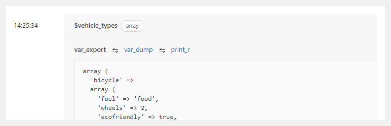
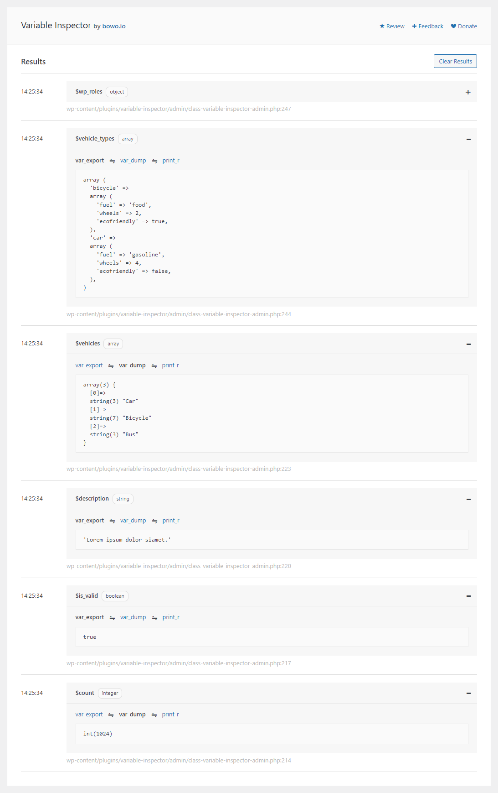

# Variable Inspector

Contributors: qriouslad  
Donate link: https://paypal.me/qriouslad  
Tags: php variables, variable dump, debug, developer  
Requires at least: 4.8  
Tested up to: 5.9.2  
Stable tag: 1.0.0  
Requires PHP: 5.6  
License: GPLv2 or later  
License URI: http://www.gnu.org/licenses/gpl-2.0.html

Easily dump and centrally inspect your PHP variables for convenient debugging.

## Description

**Variable Inspector** allows you to easily dump your PHP variables and display them in visually clean manner at a central location to help you conveniently do some code debugging work.

It aims to be an **easy and useful enough debug tool**. Perhaps somewhere between traditional [var_dump()](https://www.php.net/manual/en/function.var-dump.php) and something full-blown like [Xdebug](https://xdebug.org/). No debug info will be shown to site visitors, and the variable content is nicely formatted for review on the inspector page in wp-admin. Also, because it is a regular WordPress plugin, you simply plug-and-play with no complicated setup required.

Variable Inspector is inspired by [WP Logger](https://wordpress.org/plugins/wp-data-logger/) and [Ray](https://myray.app/).

### How to Use

Simply place the following line anywhere in your code after the `$variable_name` you'd like to inspect:

`do_action( 'inspect', [ 'variable_name', $variable_name ] );`

If you'd like to record the originating PHP file and line number, append the PHP magic constants `__FILE__` and `__LINE__` as follows.

`do_action( 'inspect', [ 'variable_name', $variable_name, __FILE__, __LINE__ ] );`

This would help you locate and clean up the inspector lines once you're done debugging. 

### Give Back

* [A nice review](https://wordpress.org/plugins/variable-inspector/#reviews) would be great!
* [Give feedback](https://wordpress.org/support/plugin/variable-inspector/) and help improve future versions.
* [Github repo](https://github.com/qriouslad/variable-inspector) to contribute code.
* [Donate](https://paypal.me/qriouslad) and support my work.

## Screenshots

1. The main Variable Inspector page
   

## Frequently Asked Questions

### How was this plugin built?

System Dashboard was built with: [WordPress Plugin Boilerplate](https://github.com/devinvinson/WordPress-Plugin-Boilerplate/) | [wppb.me](https://wppb.me/) | [CodeStar framework](https://github.com/Codestar/codestar-framework) | [Simple Accordion](https://codepen.io/gecugamo/pen/xGLyXe)

## Changelog

### 1.0.0 (April 2022)

* Initial stable release

## Upgrade Notice

None required yet.